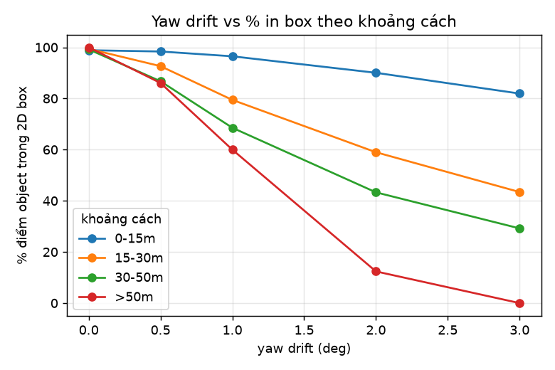
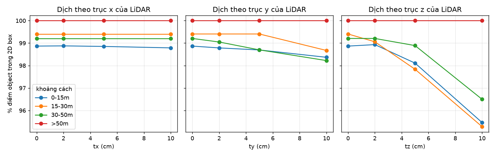
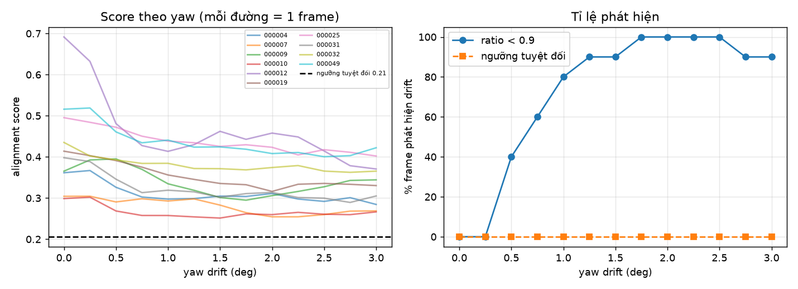
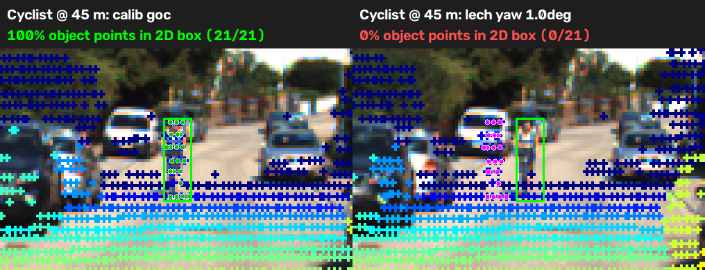
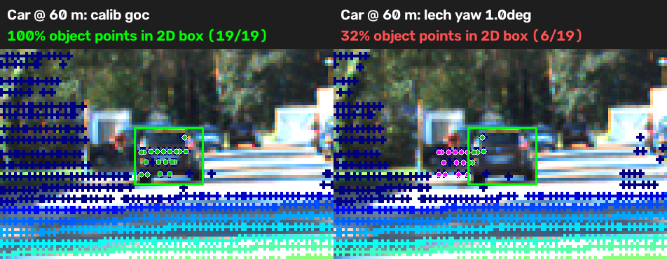

# Báo cáo Day 6: Độ nhạy của LiDAR-camera projection với calibration drift

- **Họ tên:** Nguyễn Đức Long
- **MSSV:** 2A202602917
- **Lớp:** AI20K-T4
- **Link repo:** https://github.com/duclongt23/NguyenDucLong-2A202602917-Track4-Day21
- **Topic:** A — Kiểm tra calibration LiDAR-camera bằng projection (mức Good + Advanced)
- **Dataset:** data/kitti_mini
- **Các frame đã dùng:** 000004, 000007, 000009, 000010, 000012, 000019, 000025, 000031, 000032, 000049 (56 object: Car/Van/Truck/Pedestrian/Cyclist, truncated < 0.5, ≥ 10 điểm LiDAR trong 3D box)

## 1. Claim

Lệch yaw 1° làm % điểm LiDAR của object rơi vào 2D box giảm từ 99% xuống 79% (trung bình), và mức giảm tăng theo khoảng cách: −30 điểm % ở 30–50 m và −40 điểm % ở > 50 m, so với chỉ −2 điểm % ở < 15 m. Nguyên nhân: xoay làm điểm dịch ~13 px mỗi độ bất kể khoảng cách, nên vật xa (box hẹp) mất điểm nhiều hơn. Lệch tịnh tiến 10 cm ít nghiêm trọng hơn nhiều (−3 điểm % trên trục z). Alignment score (depth edge vs Canny) phát hiện được 1° drift ở 80% frame, nhưng chỉ khi so với baseline của chính frame đó.

## 2. Evidence

Phương pháp: điểm thuộc object = điểm LiDAR trong 3D box GT, xác định bằng calib gốc. Chiếu đúng tập điểm đó bằng calib đã lệch (`starter/projection.perturb_extrinsic`) rồi đếm % điểm rơi trong 2D box của label. Mỗi lần chỉ đổi calib; frame, object, seed giữ nguyên, phép perturb tất định (chạy lại 2 lần cho CSV giống hệt từng byte). Số liệu đầy đủ: `results/yaw_perturb_sweep.csv`, `results/yaw_perturb_per_object.csv`.

**% điểm object trong 2D box theo yaw và khoảng cách** (số object: 15 / 21 / 15 / 5 / 56):

| Yaw drift | 0–15 m | 15–30 m | 30–50 m | > 50 m | Tất cả | Median dịch pixel |
|---|---|---|---|---|---|---|
| 0° | 98.9 | 99.4 | 99.2 | 100.0 | 99.3 | 0 px |
| 0.5° | 98.4 | 92.6 | 86.7 | 86.1 | 92.0 | 6.7 px |
| 1° | 96.5 | 79.4 | 68.6 | 60.0 | 79.4 | 13.4 px |
| 2° | 90.0 | 59.0 | 43.3 | 12.4 | 58.9 | 26.6 px |
| 3° | 81.9 | 43.4 | 29.2 | 0.0 | 46.1 | 39.9 px |

**Tịnh tiến (mọi khoảng cách, 56 object):**

| Dịch LiDAR | tx | ty | tz | Median dịch pixel (ty/tz) |
|---|---|---|---|---|
| 2 cm | 99.3 | 99.2 | 99.1 | 0.6 px |
| 5 cm | 99.3 | 99.1 | 98.4 | 1.6 px |
| 10 cm | 99.2 | 98.6 | 96.1 | 3.2 px |

% điểm trong FOV gần như không đổi (15.7% → 15.7–16.4%), nên **metric FOV không phát hiện được drift**; phải so với 2D box hoặc edge.

**Alignment score (Advanced)** — `src/alignment_score.py`, `results/alignment_score_sweep.csv`: score = mean(exp(−DT/3 px)) tại các điểm LiDAR có depth edge (nhảy range > 0.8 m, < 40 m), DT là distance transform của Canny. Score trung bình 0.428 ở yaw 0 giảm còn 0.353 ở 1° và ~0.34 ở ≥ 2° (bão hoà).

| Yaw | 0.5° | 0.75° | 1° | 1.25° | 1.75° | 2–2.5° |
|---|---|---|---|---|---|---|
| % frame phát hiện (ratio < 0.9 so với baseline frame) | 40 | 60 | 80 | 90 | 100 | 100 |
| % frame phát hiện (ngưỡng tuyệt đối 0.206 = mean − 2std @ 0°) | 0 | 0 | 0 | 0 | 0 | 0 |






Ảnh demo overlay yaw 1° và 3° cùng frame: `results/figures/overlay_000011_*_y1.0_*.png`, `overlay_000011_*_y3.0_*.png`.

## 3. Failure case



**fail_01 — Cyclist 44.6 m, frame 000025:** calib gốc cho 100% điểm (21/21) trong box, chỉ lệch yaw 1° còn **0%**. Box rộng khoảng 10 px, mà 1° dịch toàn bộ điểm ~12.7 px (≈ f·Δθ = 721 · 0.01745), nên toàn bộ điểm của cyclist tràn sang nền. Vật mảnh và xa chịu hậu quả nặng nhất: nếu dùng điểm LiDAR để gán nhãn, lấy depth cho 2D box hay fusion thì object này nhận depth của nền phía sau.



**fail_02 — Car 59.6 m, frame 000019:** từ 100% còn 31.6% ở 1° và 0% ở 2°. Cùng cơ chế: ngay cả xe (box lớn hơn) vẫn mất điểm khi đủ xa.

**Lớp lỗi: Geometry** (sai extrinsic/rotation giữa LiDAR và camera). Lỗi góc cho độ dịch pixel gần như hằng số theo khoảng cách (12.7–14.5 px/độ), trong khi box của vật co lại theo 1/z, nên *mismatch tương đối* tăng theo khoảng cách. Ngược lại tịnh tiến dịch ∝ f·t/z nên gây hại ở vật gần (tz 10 cm: 6.9 px ở < 15 m, 1.3 px ở > 50 m).

**Case alignment score không phát hiện được:** ngưỡng tuyệt đối (mean − 2std của score tại yaw 0, = 0.206) phát hiện **0%** frame ở mọi mức yaw, vì score baseline khác nhau nhiều giữa các frame. Chỉ so với baseline của chính frame (ratio) mới phát hiện được. Ngoài ra frame 000007 chỉ bị phát hiện từ 1.75° (000009: 1.25°; 000010/000012/000031/000049: 0.5°), nên nhìn từng frame đơn lẻ thì không đáng tin. Score cũng bão hoà ở ~0.34, không phân biệt được 2° với 3°. Lớp lỗi ở đây là **Metric** (cách đo không phản ánh mục đích phát hiện drift).

## 4. Khuyến nghị nếu triển khai thật

**Use-case:** ADAS/xe tự hành dùng LiDAR-camera fusion; calibration có thể lệch sau va chạm nhẹ hoặc rung/nhiệt. Số liệu cho thấy yaw 1° làm mất 40% điểm của vật > 50 m và ~100% điểm của vật mảnh ở 45 m, trong khi xe vẫn "chạy bình thường".

- **Nên log theo thời gian:** alignment score và ratio so với median của chính xe đó trong N phút gần nhất (không dùng ngưỡng tuyệt đối), cộng % điểm của detection LiDAR rơi trong 2D box từ camera detector. Cảnh báo khi ratio < 0.9 kéo dài nhiều frame (lọc theo thời gian để giảm báo nhầm; thí nghiệm này chưa đo mức báo nhầm).
- **Đừng dùng % điểm trong FOV** làm chỉ báo drift: gần như không đổi theo yaw.
- **Trade-off:** Canny + distance transform + tìm depth edge nhẹ, chạy ngầm ở tần số thấp (1–2 Hz) trên CPU mà không chiếm đường perception chính (chưa đo latency). Đổi lại độ trễ phát hiện vài giây và khó thấy drift < 0.5° (ratio ≈ 0.99 ở 0.25°). Khi cảnh báo, hạ tin cậy fusion cho vật xa/mảnh (cyclist, người, cột) trước vì nhóm này hỏng đầu tiên.
- **Giới hạn của thí nghiệm:** chỉ 10 frame / 56 object KITTI (64 beam, ban ngày), chỉ yaw dương và tịnh tiến đơn trục, chưa xét pitch/roll hay nuScenes 32 beam; kết quả chưa kiểm chứng trên dữ liệu khác.

## 5. Cách chạy lại

```bash
python -m venv .venv && .venv\Scripts\activate && pip install -r requirements.txt
# CP2: demo projection
python -m starter.projection --data-root data/kitti_mini --frame 000011
python -m starter.projection --data-root data/kitti_mini --frame 000011 --yaw-deg 1.0
# CP3: sweep yaw/translation -> results/yaw_perturb_sweep.csv + 2 biểu đồ
python src/calib_sweep.py
# CP4: ảnh failure
python src/make_failure_fig.py --frame 000025 --obj-idx 4 --yaw-deg 1 --out results/figures/fail_01_yaw1deg_thin_cyclist_44m.png
python src/make_failure_fig.py --frame 000019 --obj-idx 3 --yaw-deg 1 --out results/figures/fail_02_yaw1deg_far_car_60m.png
# Advanced: alignment score
python src/alignment_score.py
```

Các script có `--help`. Không có thành phần ngẫu nhiên nên chạy lại cho số liệu giống hệt (`--seed` mặc định 0).

## 6. Khai báo sử dụng AI

| Công cụ | Dùng cho việc gì | Bạn đã kiểm chứng thế nào |
|---|---|---|
| Claude Code (AI) | Hướng dẫn code và cách làm. Soạn thông tin để trả lời báo cáo | Code được chạy lại và đối chiếu với mốc của đề: điểm (10,0,0) cho z=9.727, (u,v)=(613.96,175.01); baseline dịch pixel = 0; yaw 1° dịch ~13 px khớp f·Δθ ≈ 12.6 px; chạy lại sweep 2 lần cho CSV giống hệt |
